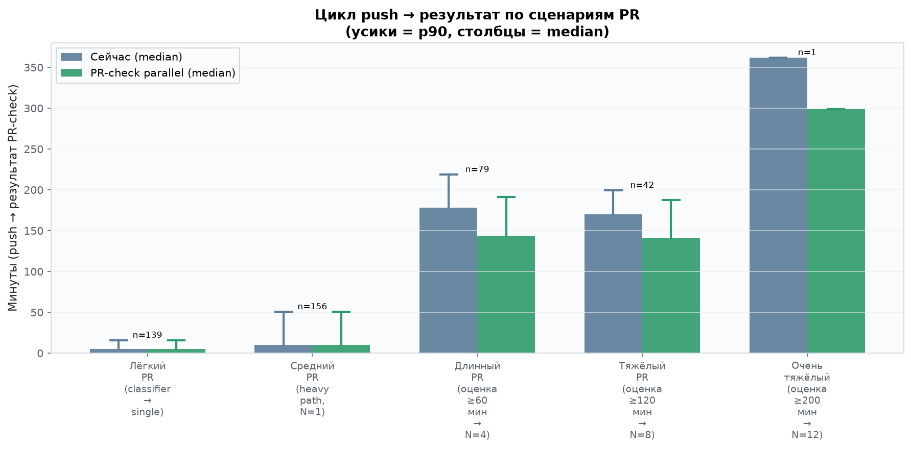
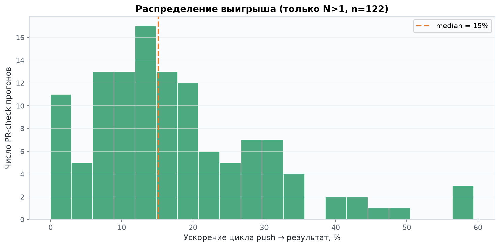
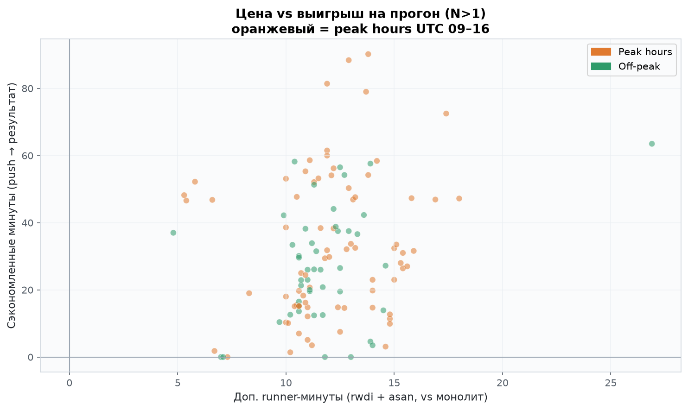
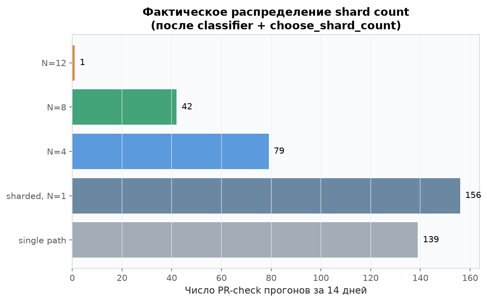
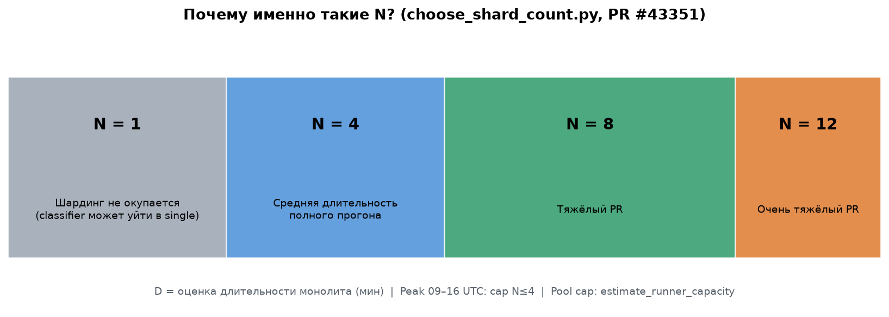
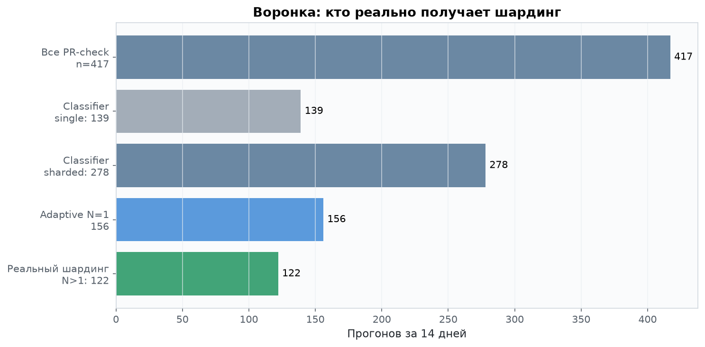
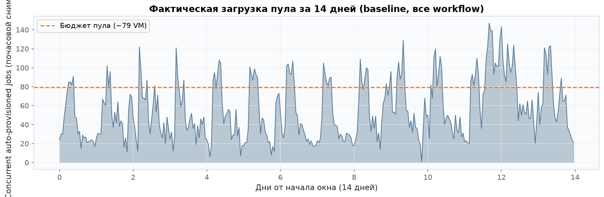
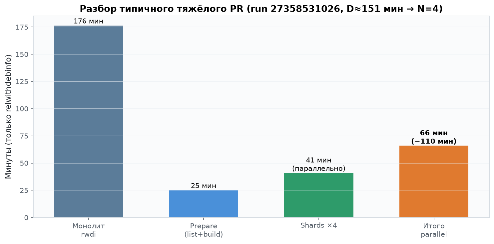
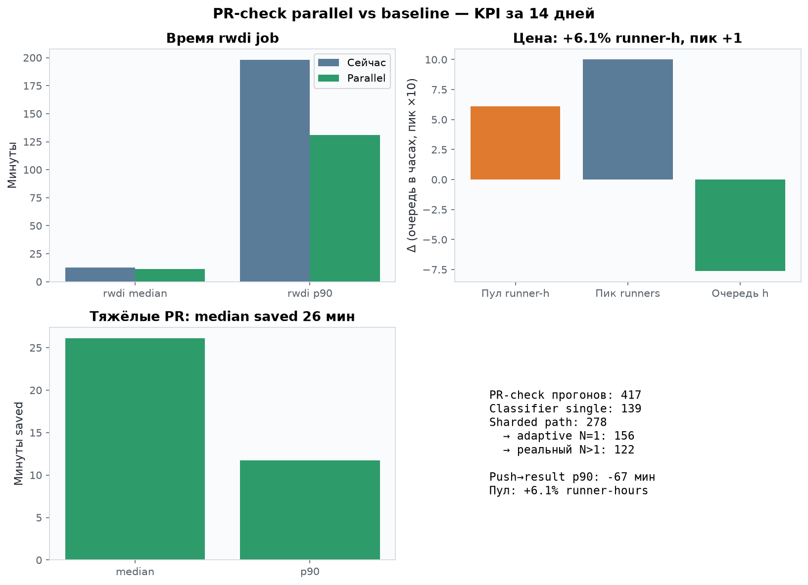

# PR-check parallel: отчёт для команды

Данные: 14 дней production GitHub Actions, 9336 auto-provisioned jobs.

## Главный вывод

**Выигрыш есть на тяжёлых PR, цена умеренная.**

- **p90 rwdi**: 198 → 131 мин (**-67 мин**)
- **Медиана rwdi**: -1.2 мин (лёгкие PR не страдают)
- **Цена для пула**: +6.1% runner-hours, пик +1 VM

## Push → результат по сценариям

| Сценарий | n | Сейчас median | Parallel median | Δ median | Δ p90 |
|----------|---|---------------|-----------------|----------|-------|
| Лёгкий PR (classifier → single) | 139 | 5 мин | 5 мин | **0** | 0 |
| Средний PR (heavy path, N=1) | 156 | 10 мин | 10 мин | **0** | 0 |
| Длинный PR (оценка ≥60 мин → N=4) | 79 | 178 мин | 144 мин | **−34 мин** | −28 мин |
| Тяжёлый PR (оценка ≥120 мин → N=8) | 42 | 170 мин | 141 мин | **−29 мин** | −12 мин |
| Очень тяжёлый (оценка ≥200 мин → N=12) | 1 | 362 мин | 298 мин | **−64 мин** | −64 мин |

## Почему именно N=1/4/8/12?

См. график `05_shard_tiers_explainer.png`:

- **D < 60 мин** → N=1 (overhead шардинга не окупается)
- **60–120 мин** → N=4
- **120–200 мин** → N=8
- **200+ мин** → N=12
- **09–16 UTC**: cap N≤4 (защита shared pool)
- **estimate_runner_capacity**: доп. cap по свободным vCPU/RAM/VM

Classifier до этого решает **single vs sharded path** по путям в diff.

## Графики

## FAQ

**Почему +6% runner-hours?** Шардинг берёт N раннеров одновременно на фазе тестов. Зато wall-clock падает — разработчик ждёт меньше.

**Почему медиана почти не меняется?** 139 PR идут в single path, ещё 156 — sharded но N=1. Шардинг затрагивает только ~122 прогона с N>1.

**Что такое push→result?** max(relwithdebinfo, release-asan) от старта первого job до завершения последнего — как видит разработчик.
